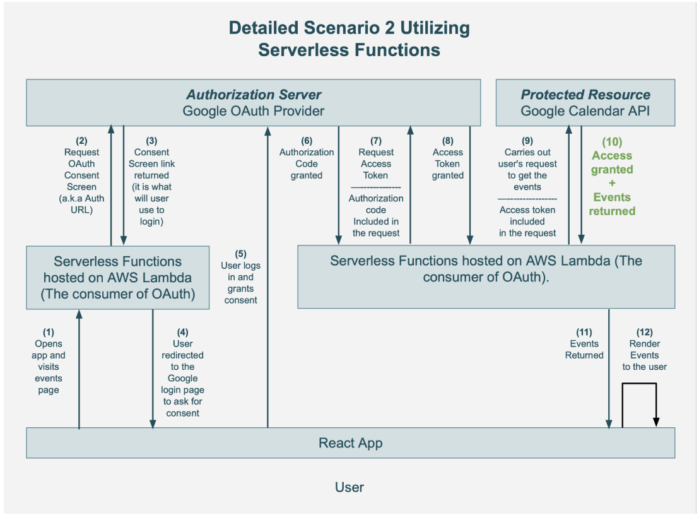

# MEET APP

## Objective:

To build a serverless, progressive web application (PWA) with React using a test-driven development (TDD) technique. The application uses the Google Calendar API to fetch upcoming events.

## Context:

**Serverless and PWAs** have grown in popularity over the last few years, and they’re both considered to
be the future of web development. By combining these two concepts, this app will not only work as a
normal web application, but it will also reap the benefits of both serverless architecture and PWAs:

1. **Serverless:** Will come to an advantage for this App for the following reasons:
   - No backend maintenance,
   - easy to scale,
   - always available,
   - no cost for idle time.
2. **PWAs:** Instant loading, offline support, push notifications, “add to home screen” prompt,
   responsive design, and cross-platform compatibility.

The serverless approach will be heavily implemented in the Authorization process to access the Google Calendar API. Several steps (documented below) will be needed to achieve this Process:

### example of serverless functions being used in a real-world product:

### Netflix's scalable on-demand media delivery

Netflix has long advocated for serverless computing. The company has been using serverless from 2017 and prior, building a platform capable of handling thousands of modifications every day. The serverless architecture at the heart of Netflix's unique Dynamic Scripting Platform handles real platform modifications, provisioning, and end-user delivery.

Publishers submit hundreds of files to Netflix every day. Each file needs to be encoded and categorized before being broadcast to the consumer. When files are uploaded to S3, Amazon initiates an event calling an AWS Lambda function, which breaks the movie into 5-minute pieces encoded into the 60 parallel streams required by Netflix. Once the last segment of the video gets analyzed, it’s aggregated and disseminated using a set of rules and triggers.

Netflix also makes use of AWS Lambda for its backup mechanism and to ensure that every single instance is built and configured in compliance with the system's rules and regulations.

### The TDD Approach

For this app, I'll be using a TDD approach, where I'll write tests before writing the actual functionality for the app in code. Writing tests forces me to focus on the requirements of my application before jumping into the code. TDD relies on the repetition of a very short development cycle, allowing me to get immediate feedback and deliver high-quality code.

### Graphical Data Visualization

Last but not least, I’ll add some graphs to my app, which will make it more visually appealing and
allow me to more easily draw conclusions from the data. A picture is worth a thousand words, right?
With a number of visualization techniques under my belt, I’ll be able to display any type of data
I want and produce a variety of output formats. My app will allow users to search for a city and
get a list of events hosted in that city. For the data visualization component, I’ll add two
charts—one that shows how many events will take place in each location (via a scatterplot), and
another that visualizes the popularity of event genres (via a pie chart).

## The 5 Ws

1. Who — The users of my Meet app. They could be me, you, my friends, my professional
   network, or my potential employers.
2. What — A progressive web app with the ability to work offline and a serverless backend
   developed using a TDD technique.
3. When — Users of this app will be able to use it whenever they want to view upcoming events
   for a specific city. Ptential recruiters will be able to see my code immediately on GitHub.
4. Where — The server, in this case, is a serverless function hosted by a cloud provider (e.g.,
   AWS). The application itself is also hosted online to make it shareable and installable. It can
   be used even when the user is offline. As it’s responsive, it displays well on any device.
5. Why — Serverless is the next generation of cloud infrastructure, PWA provides great user
   experience and performance, and the TDD technique ensures I have quality code and
   adequate test coverage. All of these skills, together with data visualization, will distinguish
   me from other web developers.

## Project Requirements Key Features:

1. Filter Events by City.
2. Show/Hide Event Details.
3. Specify Number of Events.
4. Use the App When Offline.
5. Add an App Shortcut to the Home Screen.
6. Display Charts Visualizing Event Details.

## User Stories:

- As a user, I would like to be able to filter events by city so that I can see the list of events that take place in that city.
- As a user, I would like to be able to show/hide event details so that I can see more/less information about an event.
- As a user, I would like to be able to specify the number of events I want to view in the app so that I can see more or fewer events in the events list at once.
- As a user, I would like to be able to use the app when offline so that I can see the events I viewed the last time I was online.
- As a user, I would like to be able to add the app shortcut to my home screen so that I can open the app faster.
- As a user, I would like to be able to see a chart showing the upcoming events in each city so that I know what events are organized in which city.

## Behavior-Driven Development (BDD) using Gherkin Format:

### Feature 1: Filter Events by City.

_Scenario 1:_

- Given the home page of the App with an empty input field.
- When the user DOES NOT enter any Characters in the input field.
- Then show the events for all the cities.

_Scenario 2:_

- Given the home page of the App with an empty input field.
- When the user enters Characters in the input field.
- Then show a window with the list of cities starting with the characters entered..

_Scenario 3:_

- Given a list of cities based on the characters entered by the user.
- When the user selects a city from the list.
- Then show the list of events for that city in collapsed mode.

### Feature 2: Show/Hide Event Details.

_Scenario 1:_

- Given a list of events in collapsed mode.
- When user clicks on any event
- Then Expand the event to see the details

_Scenario 2:_

- Given a detailed view of an event
- When the user clicks on the “Hide” button
- Then the detailed view is collapsed and the full events list is showing again

### Feature 3: Specify the number of Events

_Scenario 1:_

- Given a default of 32 in the input field for the number of events
- When user DOES NOT modify this number
- Then the list of events is filtered to 32 maximum events

_Scenario 2:_

- Given a default of 32 in the input field for the number of events
- When the user modifies this number
- Then the list of events is filtered to a maximum number of events based on the entered number

### Feature 4: Use the App when Offline

_Scenario 1:_

- Given a loss of internet connection
- When user DOES NOT modify the city parameters
- Then show the cashed list of events

_Scenario 2:_

- Given a loss of internet connection
- When the user modifies the city parameter
- Then show an error message

### Feature 5: Add an App shortcut to the Home screen

_Scenario 1:_

- Given the User has not installed the App yet
- When user clicks on Install App
- Then the App will be installed on the Home screen

### Feature 6: Display Charts Visualizing Event Details

_Scenario 1:_

- Given the User is on any page of the App
- When user clicks on Show Chart
- Then the App will Display a Charts Visualizing the number of events upcoming for the selected city.

## APM Testing:

Integration of Atatus APM tool to monitor the Application. The following print screens prove a fairly solid application. With potentially 1 issue showing a long Time To First Byte (TTFB) and Cumulative Layout Shift (CLS) on page load. The reason being that I was using a Proxy server to try to simulate a connection from outside of the US. The test ended up NOT showing a foreign IP address which is surprising to me, but the loading of the page TTFB was impacted.
I have additionally opened the app using an Iphone on IOS which can be seen below with decent performances.
(See print screens below).

